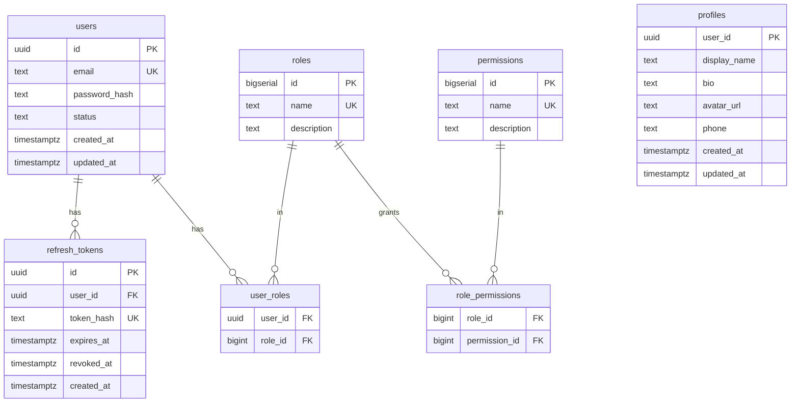

# Development Guide — iam-go

🌐 **English** | [Bahasa Indonesia](../id/development.md) · [↑ Docs index](README.md)

## Toolchain

- Go 1.26+
- Docker + Docker Compose
- Codegen tools via `make tools`: `buf`, `protoc-gen-go`, `protoc-gen-go-grpc`,
  `sqlc` (installed into `$(go env GOPATH)/bin`)

## Common commands

```bash
make tools     # install codegen tools (one-time)
make proto     # buf generate → gen/**  (from proto/**)
make sqlc      # sqlc generate → services/*/internal/db
make build     # go build ./...
make test      # go test ./...
make up        # docker compose up --build -d
make smoke     # scripts/smoke.sh http://localhost:8080
make down      # docker compose down -v
```

## Code generation

- **gRPC**: `buf.yaml` + `buf.gen.yaml` drive `buf generate`, producing
  `gen/auth/v1` and `gen/user/v1`. Edit `proto/**` then `make proto`.
- **SQL**: each service has `sqlc.yaml` + `db/queries/*.sql`; `sqlc generate`
  produces type-safe Go in `internal/db` (pgx/v5). Edit queries/migrations then
  `make sqlc`.

## Project structure

```
proto/                 canonical gRPC contracts
gen/                   generated protobuf/gRPC Go
pkg/                   shared: config, logger, jwt, password, db, migrate, grpcutil
services/auth/         Auth gRPC service (handler, sqlc db, migrations, embed.go)
services/user/         User gRPC service
services/gateway/      Gin REST gateway (router, middleware, grpc clients)
deploy/                docker-compose, .env, postgres-init, k8s
scripts/smoke.sh       end-to-end test
```

Request path: `gateway/internal/router` → middleware (`auth.go`: AuthN + AuthZ)
→ gRPC client (`internal/client`) → service handler → `internal/db` (sqlc) →
Postgres.

## Testing

`make test` runs unit tests (e.g. JWT sign/verify/expiry in `pkg/jwt`). The
end-to-end behavior (auth flow, refresh rotation, revocation, dynamic RBAC) is
covered by `scripts/smoke.sh` against a running stack.

## Database schema (ERD)



`users`, `refresh_tokens`, `roles`, `permissions`, `role_permissions`,
`user_roles` live in **auth_db**; `profiles` lives in **user_db** (keyed by the
`user_id` minted by Auth — no cross-database FK).

## Conventions

- Conventional Commits (see [CONTRIBUTING](../../CONTRIBUTING.md)).
- Keep handlers thin; put SQL in `db/queries`, regenerate with sqlc.
- Map domain errors to gRPC `codes`; the gateway maps those to HTTP statuses
  (`writeGRPCError` in `services/gateway/internal/router/router.go`).
- Update docs in **both** `docs/en` and `docs/id` when behavior changes.
