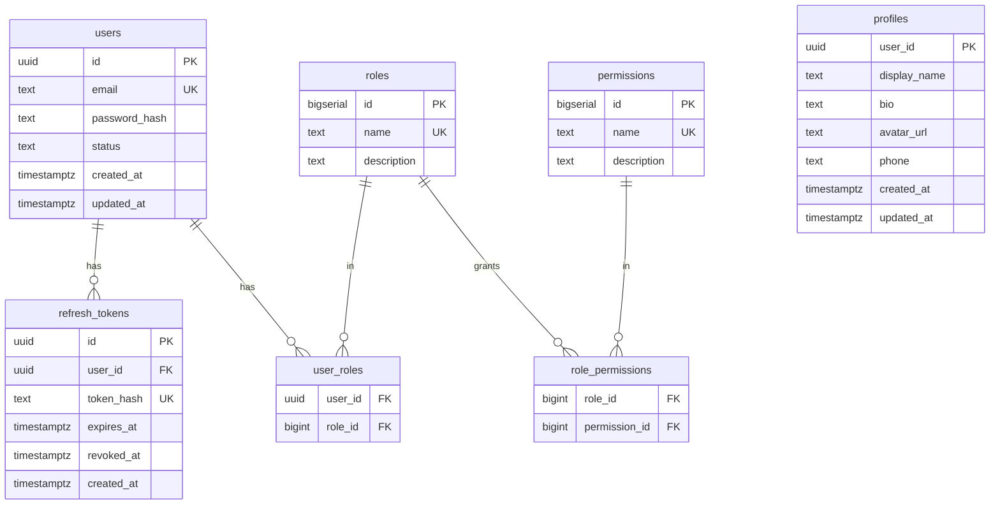

# Panduan Pengembangan — iam-go

🌐 [English](../en/development.md) | **Bahasa Indonesia** · [↑ Indeks dokumentasi](README.md)

## Toolchain

- Go 1.26+
- Docker + Docker Compose
- Tool codegen via `make tools`: `buf`, `protoc-gen-go`, `protoc-gen-go-grpc`,
  `sqlc` (diinstal ke `$(go env GOPATH)/bin`)

## Perintah umum

```bash
make tools     # install codegen tools (one-time)
make proto     # buf generate → gen/**  (from proto/**)
make sqlc      # sqlc generate → services/*/internal/db
make build     # go build ./...
make test      # go test ./...
make up        # docker compose up --build -d
make smoke     # scripts/smoke.sh http://localhost:8080
make down      # docker compose down -v
```

## Pembuatan kode

- **gRPC**: `buf.yaml` + `buf.gen.yaml` menggerakkan `buf generate`, menghasilkan
  `gen/auth/v1` dan `gen/user/v1`. Edit `proto/**` lalu `make proto`.
- **SQL**: setiap layanan memiliki `sqlc.yaml` + `db/queries/*.sql`; `sqlc generate`
  menghasilkan Go yang type-safe di `internal/db` (pgx/v5). Edit query/migrasi lalu
  `make sqlc`.

## Struktur proyek

```
proto/                 canonical gRPC contracts
gen/                   generated protobuf/gRPC Go
pkg/                   shared: config, logger, jwt, password, db, migrate, grpcutil
services/auth/         Auth gRPC service (handler, sqlc db, migrations, embed.go)
services/user/         User gRPC service
services/gateway/      Gin REST gateway (router, middleware, grpc clients)
deploy/                docker-compose, .env, postgres-init, k8s
scripts/smoke.sh       end-to-end test
```

Jalur request: `gateway/internal/router` → middleware (`auth.go`: AuthN + AuthZ)
→ klien gRPC (`internal/client`) → handler layanan → `internal/db` (sqlc) →
Postgres.

## Pengujian

`make test` menjalankan unit test (mis. sign/verify/expiry JWT di `pkg/jwt`).
Perilaku end-to-end (alur auth, rotasi refresh, pencabutan, RBAC dinamis) dicakup
oleh `scripts/smoke.sh` terhadap stack yang sedang berjalan.

## Skema database (ERD)



`users`, `refresh_tokens`, `roles`, `permissions`, `role_permissions`,
`user_roles` berada di **auth_db**; `profiles` berada di **user_db** (dikunci dengan
`user_id` yang dihasilkan oleh Auth — tanpa FK lintas-database).

## Konvensi

- Conventional Commits (lihat [CONTRIBUTING](../../CONTRIBUTING.md)).
- Buat handler tetap ramping; letakkan SQL di `db/queries`, regenerasi dengan sqlc.
- Petakan error domain ke `codes` gRPC; gateway memetakannya ke status HTTP
  (`writeGRPCError` di `services/gateway/internal/router/router.go`).
- Perbarui dokumen di **kedua** `docs/en` dan `docs/id` ketika perilaku berubah.
